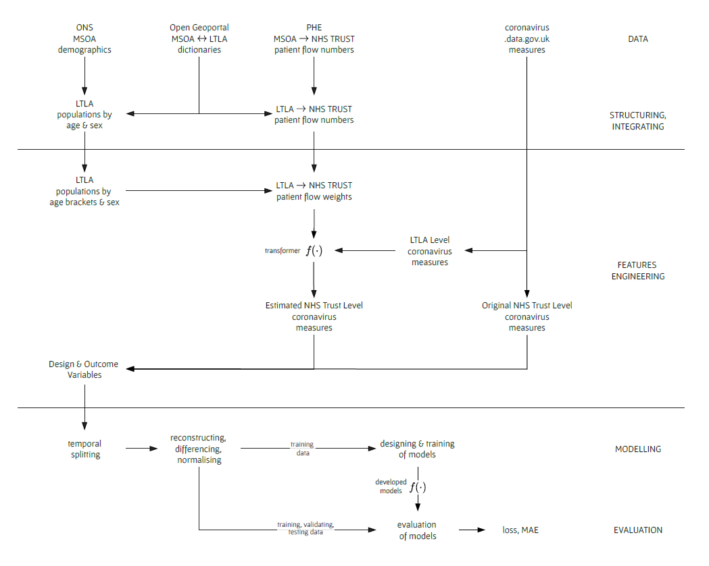

 

[SCC460 Group Project](#scc460-group-project)
* [Aim](#aim)
* [Research Question](#research-question)
* [Objectives](#objectives)
* [Code](#code-development)
* [Project Steps](#project-steps)  
* [Official Report](#official-report)  
* [Data](#data)

 
 

### SCC460 Group Project

This is the *group project* code repository of a Lancaster University Medical School *Health Data Science* 
team.  The project's host is Lancashire Teaching Hospitals NHS Foundation Trust, and hence the project's
aim and objectives - below - are in line with their requirements.  

Additionally, an important aim of the Trust, which led to an implicit project objective, is to **develop 
best practices w.r.t. data science solutions development within a collaborative Cloud Environment**.  It 
is an aim focused on the continuous development & delivery of data science based/driven insights and 
solutions; by a variety of experts & data professionals, for a variety of health teams.  Its key 
underlying features include &rarr; automated, reproducible, repeatable, and trackable

* Ingestion of multi-formatted data from a variety of trackable data sources, each with a data schema.
* Data cleaning, <a href='' title='Does the NHS Trust code exist?'>validation</a>, and 
  <a href='Is each NHS Trust code formatted as a three etter code?' title='verification'>verification</a>
* Data structuring and integration.
* Modelling & evaluation.
* Syntheses of results.
* Interactive graphs and/or interactive reports.

Supported by version control technology, and informed 
by [DataOps](https://medium.com/data-ops/what-is-dataops-ten-most-common-questions-ffc09c09c921) practices.  To 
this end, our programs & programming are informed by DataOps and software engineering best practices; albeit time 
constraints mean some steps have been skipped.

 

#### Aim
> To develop a prediction model that forecasts what the expected number of patient admissions will/might be - per day, 
> N weeks ahead, and per NHS Trust - during an infectious disease pandemic.

 
 

#### Research Question
> How many future admissions should a NHS trust expect during an infectious disease pandemic?

 
 

#### Objectives
> * Understanding, determining, the range of predictors that influence SARS-CoV-2 hospital admissions per NHS Trust
> 
> * Forecasting N weeks ahead

 
 

#### The Programs

The project's programs are Python programs, and they rely on the packages 
listed in [requirements.txt](./requirements.txt) / [dependency graph](https://github.com/premodelling/infections/network/dependencies).  Refer 
to the [development notes](./development/) for more about the Python code & development environment.  Additionally:

directory | contents
:--- | :---
[data](data) | The project's raw data.  Each directory  consists of the raw data and links to the source, or API links.
[src](src) | The project's code; including notes.
[warehouse](warehouse) | The data structuring & integration, analysis,  modelling, and evaluations **outputs**.
[docs](docs) | [papers](docs/papers), [book chapters](docs/texts), [project documents](docs/project)
[notebooks](notebooks) | Explorations and modelling notebooks.

 
 

#### Project Steps

*Figure 1* outlines the project's steps.  A number of Python programs underlie these steps.  The programs can be run 
via two, interface styled, Jupyter Lab notebooks that are responsible for different groups of steps &rarr;

* [preliminary.ipynb](preliminary.ipynb): focused on the structuring, integrating, and features engineering steps of the project  
  Read Only Viewer 

* [modelling.ipynb](modelling.ipynb): focused on the modelling & evaluation steps of the project  
  Read Only Viewer 

Each notebook has brief introductory notes.

 

 

> **Figure 1**: A high level illustration of the project's processing, analysis, modelling, and evaluation steps. The acronyms/abbreviations are
API: application programming interface, MSOA: middle layer super output area ([a United Kingdom census geography](https://www.ons.gov.uk/methodology/geography/ukgeographies/censusgeography)),
LTLA: lower tier local authority ([a United Kingdom admnitrative geography](https://www.ons.gov.uk/methodology/geography/ukgeographies/administrativegeography)),
ONS: office for national statistics, NHS: national health service, PHE: Public Health England.  The ONS, NHS, and PHE, are United Kingdom entities.
>
> The data sources are &rarr; England's SARS-CoV-2 infections related measures: [coronavirus.data.gov.uk API](https://coronavirus.data.gov.uk/details/developers-guide/main-api),
demographics data: [ONS](https://www.ons.gov.uk/peoplepopulationandcommunity/populationandmigration/populationestimates/datasets/middlesuperoutputareamidyearpopulationestimates),
MSOA &lrarr; LTLA geographic codes mappings: [Open Geography Portal (geoportal)](https://geoportal.statistics.gov.uk/search?collection=Dataset&sort=name&tags=all(LUP_MSOA_WD_LAD)),
annual intake of patients from one or more MSOA areas to an NHS Trust: **(a)** [NHS Trust Catchments Estimation](https://app.box.com/s/qh8gzpzeo1firv1ezfxx2e6c4tgtrudl), **(b)**
[visualisations of](https://app.powerbi.com/view?r=eyJrIjoiODZmNGQ0YzItZDAwZi00MzFiLWE4NzAtMzVmNTUwMThmMTVlIiwidCI6ImVlNGUxNDk5LTRhMzUtNGIyZS1hZDQ3LTVmM2NmOWRlODY2NiIsImMiOjh9)
>
> Please refer to the [project report](https://github.com/premodelling/trusts/raw/master/trusts.pdf) for a description of (a) the patient flow weights, and (b) the
> estimation of NHS trust level measures via flow weights and LTLA level measures.

 
 

#### Official Report

The [report submitted for grading](https://github.com/premodelling/trusts/raw/master/trusts.pdf) with a small correction &xrarr; the captions 
of *figures 4, 5, & 6* [have been added/updated](https://github.com/premodelling/trusts/commit/09d076836641524f005c831576dbf893dac8c0e5). 

 
 

#### The Data

The project relies on

* [coronavirus.data.gov.uk](https://coronavirus.data.gov.uk)
* Public Health England's [NHS Acute Hospital Trust Catchment Populations & Patient Flows](https://app.powerbi.com/view?r=eyJrIjoiODZmNGQ0YzItZDAwZi00MzFiLWE4NzAtMzVmNTUwMThmMTVlIiwidCI6ImVlNGUxNDk5LTRhMzUtNGIyZS1hZDQ3LTVmM2NmOWRlODY2NiIsImMiOjh9)
* The Office for National Statistics' [Middle Super Output Area (MSOA) Population Estimates](https://www.ons.gov.uk/peoplepopulationandcommunity/populationandmigration/populationestimates/datasets/middlesuperoutputareamidyearpopulationestimates)
* The Open Geography Portal's middle super output area (MSOA) & lower tier local authority (LTLA) [mappings](https://geoportal.statistics.gov.uk/search?collection=Dataset&sort=name&tags=all(LUP_MSOA_WD_LAD))

 

A key challenge of the project was the varying granularity of the [coronavirus.data.gov.uk](https://coronavirus.data.gov.uk) data. In brief, the project required 
SAR-CoV-2 / coronavirus 19 disease measures of NHS Trust Level granularity; for NHS Trust Level forecasting.  However, many measures are not available at 
this granularity, the richest set of measures exist at the lower tier local authority (LTLA) level.   Additionally, the measures are not available at 
a granularity from whence we can directly aggregate to NHS Trust Level.  To address this problem the project estimated **LTLA &rarr; NHS Trust Level** 
transformation weights 

* Via the patients, populations, and geographic data sets of *Figure 1*; especially the [MSOA &rarr; NHS Trust patient flow history data](https://app.box.com/s/qh8gzpzeo1firv1ezfxx2e6c4tgtrudl)
* Influenced by Public Health England's [NHS Catchment estimation approach](https://app.powerbi.com/view?r=eyJrIjoiODZmNGQ0YzItZDAwZi00MzFiLWE4NzAtMzVmNTUwMThmMTVlIiwidCI6ImVlNGUxNDk5LTRhMzUtNGIyZS1hZDQ3LTVmM2NmOWRlODY2NiIsImMiOjh9).

The MSOA &rarr; NHS Trust patient flow history data is critical because each MSOA geographic area is a member of a 
single LTLA geographic area.  Hence, an indirect variable for estimating  **LTLA &rarr; NHS Trust Level**
transformation weights.  The table below list the project's Estimated NHS Trust Level variables; each based on estimated 
transformation weights.

 

variable | Estimated NHS Trust Level 1 | NHS Trust Level | description (per day)
 :--- | :--- | :--- | :---
``date`` |  |  |
``covidOccupiedBeds`` | | &#10003; | The \# of beds occupied by coronavirus disease  patients.
``covidOccupiedMVBeds`` | | &#10003; | The \# of mechanical ventilation beds occupied by   coronavirus disease patients
``estimatedNewAdmissions`` | | &#10003; | The day's/date's estimated new admissions, estimated by an NHS England entity.
``EDC0-4``, ``EDC5-9``, ``EDC10-14``, ...  ``EDC80-84``, ``EDC85-89``, ``EDC90+``  | &#10003; | | The estimated \# of daily cases (EDC) by age group.
``dailyCases`` | &#10003; | | The \# of estimated daily cases.
``newDeaths28DaysByDeathDate`` | &#10003; | | The \# of estimated daily deaths, whereby each death occurred *within 28 days of a first positive* *laboratory-confirmed test*. 2
``dailyFirstDoseByVaccinationDate`` | &#10003; | | The daily estimated \# of first vaccinations  by vaccination date.
``dailySecondDoseByVaccinationDate`` | &#10003; | | The daily estimated \# of second vaccinations  by vaccination date.
``dailyThirdInjectionByVaccinationDate`` | &#10003; | | The daily estimated \# of third vaccinations  by vaccination date.
``EDV12-15``, ``EDV16-17``, ``EDV18-24``,  ``EDV25-29``, ``EDV30-34``, ``EDV35-39``, ...,  ``EDV80-84``, ``EDV85-89``, ``EDV90+``  | &#10003; | | The estimated \# of daily vaccinations (EDV) by age group; second vaccinations.

1 The project estimates are transformations from lower tier local authority (LTLA) level measures, based on 
estimated **LTLA &rarr; NHS Trust Level** transformation weights.

 
 
 
 

 
 
 
 

