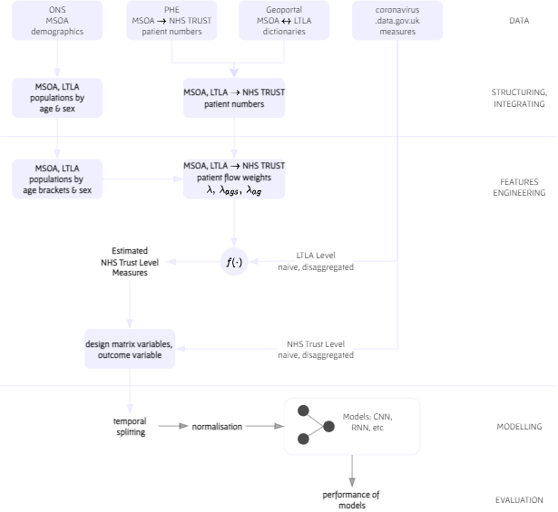

 

* [data](data)  
  The project's raw data.  Each directory consists of the raw data and links to the source, or API links.

* [development](development)  
  The Python development environment notes.

* [docs](docs)  
  [papers](docs/papers), [book chapters](docs/texts), [project documents](docs/project)

* [notebooks](notebooks)  
  [exploration notebooks](./notebooks#exploration-notebooks)

* [src](src)  
  The project's code and accompanying notes.

* [warehouse](warehouse)  
  The data structuring & integration, analysis, modelling, and evaluations outputs.

 
 

## SCC460 Group Project

**Aim**
> To develop a prediction model that forecasts what the expected number of patient admissions will/might be - per day, 
> N weeks ahead, and per NHS Trust - during an infectious disease pandemic.

 

**Research Question**
> How many future admissions should a NHS trust expect during an infectious disease pandemic?

 

**Objectives**
> * Understanding, determining, the range of predictors that influence SARS-CoV-2 hospital admissions per NHS Trust
> 
> * Forecasting N weeks ahead

 
 

## Data 

The project relies on

* [coronavirus.data.gov.uk](https://coronavirus.data.gov.uk)
* Public Health England's [NHS Acute Hospital Trust Catchment Populations & Patient Flows](https://app.powerbi.com/view?r=eyJrIjoiODZmNGQ0YzItZDAwZi00MzFiLWE4NzAtMzVmNTUwMThmMTVlIiwidCI6ImVlNGUxNDk5LTRhMzUtNGIyZS1hZDQ3LTVmM2NmOWRlODY2NiIsImMiOjh9)
* The Office for National Statistics' [Middle Super Output Area Population Estimates](https://www.ons.gov.uk/peoplepopulationandcommunity/populationandmigration/populationestimates/datasets/middlesuperoutputareamidyearpopulationestimates)
* The Office for National Statistics' middle super output area (MSOA) & lower tier local authority (LTLA) [mappings](https://geoportal.statistics.gov.uk/search?collection=Dataset&sort=name&tags=all(LUP_MSOA_WD_LAD))

data sets, which required the structuring, transformations, and integrations outlined below.

 

 

### data.gov.uk SARS-CoV-2 Infection Measures

The government's coronavirus measures have been a challenge due to their disparate units of measure.  The table below outlines this point, and it is this issue that underlies
the need for the additional data sets, i.e., the above-listed patients, populations, and geographic data sets.

 

variable | [LTLA](./warehouse/virus/ltla/measures) | [NHS Trust](./warehouse/virus/trusts/measures) | Prospective Outcome Variable
 :--- | :--- | :--- | :---
``date`` | &#10003; | &#10003; |
``dailyCases`` 1 | &#10003; | |
``newDeaths28DaysByDeathDate`` | &#10003; | |
``dailyFirstDoseByVaccinationDate`` | &#10003; | |
``dailySecondDoseByVaccinationDate`` | &#10003; | |
``dailyThirdInjectionByVaccinationDate`` | &#10003; | |
``VaccineRegisterPopulationByVaccinationDate`` 2, 3 | &#10003; | |
``newVirusTestsBySpecimenDate`` | &#10003; | |
``newPCRTestsBySpecimenDate`` | &#10003; | |
``covidOccupiedBeds`` | | &#10003; |
``covidOccupiedMVBeds`` | | &#10003; |
``estimatedNewAdmissions`` | | &#10003; | &#10003;

1 [daily cases disaggregated by age, per LTLA, are available](./warehouse/virus/ltla/demographic/cases) 
2 The values of this field are probably erroneous.  
3 [age disaggregated vaccinations series, per LTLA, are available](./warehouse/virus/ltla/demographic/vaccinations)

 

### Estimated NHS Trust Level Measures

The table below outlines a set of Estimated NHS Trust Level data.  The project estimated transformation factors/weights based on **(a)** the LTLA 
measures, **(b)** and the above-listed patients, populations, and geographic data sets, and **(c)** Public Health England's 
[NHS Trust Catchment estimation](https://app.powerbi.com/view?r=eyJrIjoiODZmNGQ0YzItZDAwZi00MzFiLWE4NzAtMzVmNTUwMThmMTVlIiwidCI6ImVlNGUxNDk5LTRhMzUtNGIyZS1hZDQ3LTVmM2NmOWRlODY2NiIsImMiOjh9) approach.

 

variable | Estimated NHS Trust Level 1 | NHS Trust Level | description (per day)
 :--- | :--- | :--- | :---
``date`` |  |  |
``covidOccupiedBeds`` | | &#10003; | The \# of beds occupied by coronavirus disease  patients.
``covidOccupiedMVBeds`` | | &#10003; | The \# of mechanical ventilation beds occupied by   coronavirus disease patients
``estimatedNewAdmissions`` | | &#10003; | The day's/date's estimated new admissions, estimated by an NHS England entity.
``EDC0-4``, ``EDC5-9``, ``EDC10-14``, ...  ``EDC80-84``, ``EDC85-89``, ``EDC90+``  | &#10003; | | The estimated \# of daily cases (EDC) by age group.
``dailyCases`` | &#10003; | | The \# of estimated daily cases.
``newDeaths28DaysByDeathDate`` | &#10003; | | The \# of estimated daily deaths, whereby each death occurred *within 28 days of a first positive* *laboratory-confirmed test*. 2
``dailyFirstDoseByVaccinationDate`` | &#10003; | | The daily estimated \# of first vaccinations  by vaccination date.
``dailySecondDoseByVaccinationDate`` | &#10003; | | The daily estimated \# of second vaccinations  by vaccination date.
``dailyThirdInjectionByVaccinationDate`` | &#10003; | | The daily estimated \# of third vaccinations  by vaccination date.
``EDV12-15``, ``EDV16-17``, ``EDV18-24``,  ``EDV25-29``, ``EDV30-34``, ``EDV35-39``, ...,  ``EDV80-84``, ``EDV85-89``, ``EDV90+``  | &#10003; | | The estimated \# of daily vaccinations (EDV) by age group; second vaccinations.

1 Project estimates based on the government's lower tier local authority (LTLA) level COVID-19 measures, and Public Health England
patients flow data; yearly flow patterns from middle super output area (MSOA) entities to NHS Trusts.

 
 

## Exploration, Modelling, Analysis

The variables of the table above are the variables that underlie the project's explorations, modelling, and analysis.  The prepared data set per 
NHS Trust is available at

> [warehouse/design/raw](./warehouse/design/raw)

Thus far, prototypes.  The directory [prototyping](./src/prototyping) hosts the underlying programs of the prototype notebooks

* [multiple steps ahead](./notebooks#exploration-notebooks)
* [single step ahead](./notebooks#exploration-notebooks)

 
 
 
 

 
 
 
 

